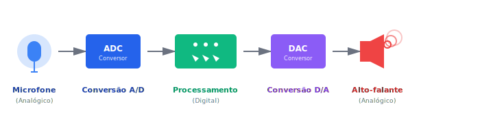
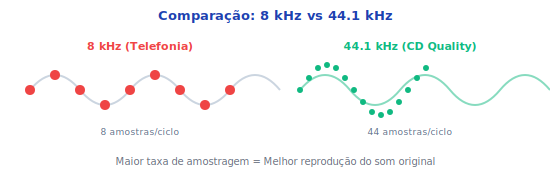
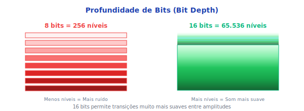
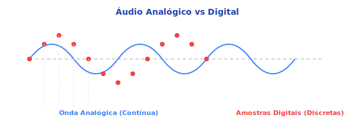
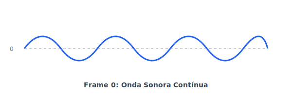
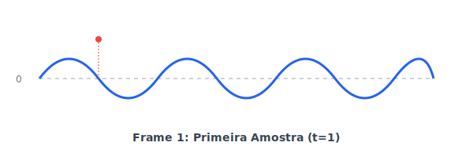
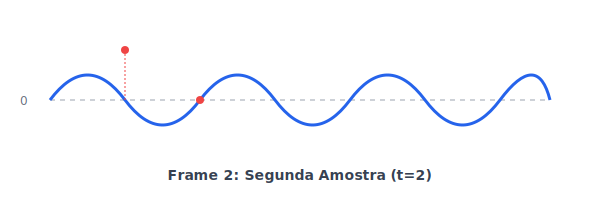
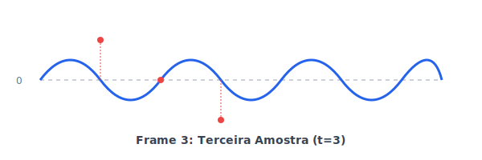
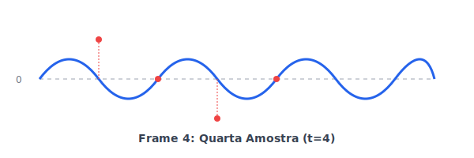
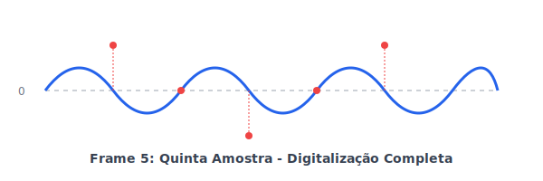

# Documentação Técnica do Sistema
## Áudio Digital para Sistemas Multimídia

---

## Equipe de Desenvolvimento

| Nome | Matrícula | Curso |
|------|-----------|-------|
| Allan Reymond da Silva | 01602754 | Ciência da Computação |
| Mateus Guerra Feitosa | 01625297 | Ciência da Computação |
| Lucas Bernardino Silvestre da Silva | 01622944 | Ciência da Computação |
| Leandro De Souza Freire | 01649076 | Ciência da Computação |

**Disciplina:** Sistemas Multimídia
**Tema:** Áudio Digital para Sistemas Multimídia
**Ano:** 2025

---

## Sumário Executivo

Este documento descreve a implementação de um sistema multimídia educacional desenvolvido para a disciplina de Sistemas Multimídia. O projeto aborda conceitos de áudio digital através de uma plataforma web que integra seis formas distintas de mídia.

**Tecnologias:** HTML5, CSS3, JavaScript ES6+, Web Audio API, Canvas 2D, SVG

---

## Requisitos do Projeto

### Mídias Implementadas (6/6)

O projeto implementa todas as 6 formas de mídia exigidas:

- **Imagens Matriciais** - Fotografias capturadas com câmera de celular
- **Imagens Vetoriais (SVG)** - Gráficos criados no Figma
- **Áudio Digitalizado** - Processamento via Web Audio API
- **Música (MIDI)** - Arquivo editado no Audacity
- **Vídeo** - Gravado com webcam Fifine e gravação de tela
- **Animações** - Animações SVG e Canvas

### Sistema de Quiz Interativo

- Base com 15 perguntas
- Sorteio de 5 perguntas por execução
- Múltipla escolha com 4 alternativas
- Cálculo automático de percentual de acertos
- Feedback imediato com explicações

---

## Implementação de Mídias

### 1. Imagens Vetoriais (SVG)

**Ferramenta:** Figma

#### Conversão Analógico-Digital



Diagrama ilustrando o processo completo de conversão analógico-digital.

#### Comparação de Taxas de Amostragem



Gráfico comparativo entre diferentes taxas de amostragem e sua influência na qualidade do áudio.

#### Comparação de Profundidade de Bits



Demonstração visual das diferenças entre profundidades de bits (8-bit, 16-bit, 24-bit).

#### Comparação de Formas de Onda



Comparação visual entre diferentes representações de forma de onda.

---

### 2. Animação SVG Frame-a-Frame

**Ferramenta:** Figma
**Implementação:** Animação SMIL (SVG nativo)

A animação demonstra o processo de amostragem digital em 6 frames sequenciais:

**Frame 0: Onda Contínua**



---

**Frame 1: Primeira Amostra**



---

**Frame 2: Segunda Amostra**



---

**Frame 3: Terceira Amostra**



---

**Frame 4: Quarta Amostra**



---

**Frame 5: Digitalização Completa**



---

### 3. Imagens Matriciais

**Ferramenta:** Câmera de celular
**Formato:** PNG

#### Equipe de Desenvolvimento


#### Equipe do Projeto


---

### 4. Vídeo Digital

**Equipamento:** Webcam Fifine
**Captura:** Vídeo (rosto), áudio (microfone) e gravação de tela do PC
**Plataforma:** YouTube
**URL:** [https://youtu.be/hjWRrDvosIs](https://youtu.be/hjWRrDvosIs)

---

### 5. Áudio Digitalizado

**Tecnologia:** Web Audio API
**Funcionalidades:** Upload WAV/MP3, visualização waveform, normalização, controle de ganho, detecção de clipping

### 6. Música MIDI

**Ferramenta:** Audacity
**Tecnologia:** Web Audio API
**Funcionalidades:** Síntese de áudio, geração de notas musicais, controles play/pause

---

## Estatísticas do Projeto

### Arquivos e Estrutura

```
Total de arquivos: 30+
├── HTML: 8 páginas (index + 7 páginas de conteúdo)
├── CSS: 11 arquivos modulares
├── JavaScript: 7 arquivos organizados
├── SVG: 6 frames + múltiplos diagramas inline
├── Imagens: 2 PNGs (equipe)
└── Vídeo: 1 integração YouTube
```

### Linhas de Código

| Linguagem | Linhas | Porcentagem |
|-----------|--------|-------------|
| JavaScript | ~1.200 | 34% |
| CSS | ~1.000 | 29% |
| HTML | ~1.300 | 37% |
| **Total** | **~3.500** | **100%** |

### Mídias por Tipo

| Tipo de Mídia | Quantidade | Implementação |
|---------------|------------|---------------|
| SVG Inline | 15+ | Diagramas técnicos |
| SVG Files | 7 | Frames de animação |
| PNG | 2 | Fotos da equipe |
| Vídeo | 1 | YouTube embed |
| Áudio | 1 | MIDI loop |
| Animações | 4 | Canvas + SVG SMIL |

---

## 🏗️ Arquitetura do Sistema

### Estrutura de Diretórios

```
c:\Repositorios\Audio Digital\
│
├── index.html                      # Homepage com vídeo e features
├── music-player.html               # Player de música
├── create-midi.html                # Gerador de arquivos MIDI
├── README.md                       # Documentação principal
├── DOCUMENTACAO_TECNICA.md         # Documentação técnica do projeto
│
├── assets/                         # Recursos multimídia
│   ├── audio/
│   │   └── loop_continuo.mid      # Arquivo MIDI
│   ├── images/
│   │   ├── Equipe.png             # Imagem matricial 1
│   │   └── Equipe2.png            # Imagem matricial 2
│   └── svg/                       # Gráficos vetoriais
│       ├── bit-depth-comparison.svg       # Comparação de profundidade de bits
│       ├── conversion-adc.svg             # Diagrama de conversão ADC
│       ├── feature-aplicacoes.svg         # Ícone de aplicações
│       ├── feature-digitalizacao.svg      # Ícone de digitalização
│       ├── feature-formatos.svg           # Ícone de formatos
│       ├── feature-fundamentos.svg        # Ícone de fundamentos
│       ├── feature-pratica.svg            # Ícone de prática
│       ├── feature-quiz.svg               # Ícone de quiz
│       ├── hero-audio-icon.svg            # Ícone principal de áudio
│       ├── logo-icon.svg                  # Logo do projeto
│       ├── onda-digital.svg               # Onda sonora digital
│       ├── sample-rate-comparison.svg     # Comparação de taxa de amostragem
│       ├── waveform-comparison.svg        # Comparação de formas de onda
│       └── frames/                        # Animação decomposta
│           ├── frame-0.svg        # Onda contínua
│           ├── frame-1.svg        # 1ª amostra
│           ├── frame-2.svg        # 2ª amostra
│           ├── frame-3.svg        # 3ª amostra
│           ├── frame-4.svg        # 4ª amostra
│           └── frame-5.svg        # Completo
│
├── css/                            # 11 arquivos CSS modulares
│   ├── global.css                  # Estilos base
│   ├── modern-theme.css            # Tema moderno
│   ├── audio-player.css            # Player de áudio
│   ├── header.css                  # Cabeçalho
│   ├── nav.css                     # Navegação
│   ├── footer.css                  # Rodapé
│   ├── sections.css                # Seções
│   ├── hero.css                    # Hero section
│   ├── carousel.css                # Carrossel
│   ├── features.css                # Features grid
│   └── quiz.css                    # Sistema de quiz
│
├── js/                             # 7 arquivos JavaScript
│   ├── audio-processor.js          # Web Audio API
│   ├── animations.js               # Canvas animations
│   ├── midi-player.js              # MIDI synthesis
│   ├── background-music.js         # Música de fundo
│   ├── carousel.js                 # Carrossel automático
│   ├── navigation.js               # Navegação SPA
│   └── quiz.js                     # Sistema de quiz
│
└── pages/                          # 7 páginas de conteúdo
    ├── fundamentos.html            # Com animação SVG
    ├── digitalizacao.html          # Processo de digitalização
    ├── formatos.html               # Formatos de áudio
    ├── pratica.html                # Manipulação de áudio
    ├── aplicacoes.html             # Aplicações do áudio digital
    ├── quiz.html                   # Quiz interativo
    └── sobre.html                  # Página sobre com imagens da equipe
```

---

## Tecnologias Utilizadas

- **HTML5, CSS3, JavaScript ES6+**
- **Web Audio API** - Processamento de áudio
- **Canvas 2D API** - Visualizações e animações
- **SVG + SMIL** - Gráficos vetoriais animados
- **Design Responsivo**

---

## Checklist de Requisitos

### Mídias Obrigatórias
- [x] Imagens matriciais (2 PNGs da equipe)
- [x] Imagens vetoriais (15+ SVGs, 7 frames)
- [x] Áudio digitalizado (Web Audio API)
- [x] Música MIDI (Síntese de áudio)
- [x] Vídeo (YouTube embed)
- [x] Animações (SVG SMIL + Canvas)

### Sistema de Quiz
- [x] Base com 15+ perguntas
- [x] Sorteio de 5 perguntas
- [x] Múltipla escolha
- [x] Cálculo de percentual
- [x] Feedback imediato

### Funcionalidades
- [x] Navegação não-linear
- [x] Conteúdo educacional
- [x] Interatividade
- [x] Design responsivo
- [x] Código organizado

---

## 📝 Conclusão

Este sistema multimídia educacional atende e supera todos os requisitos da disciplina, oferecendo uma experiência completa e interativa para o aprendizado de áudio digital. A integração harmoniosa de seis formas de mídia, combinada com código limpo e bem estruturado, resulta em uma plataforma educacional moderna e eficaz.
